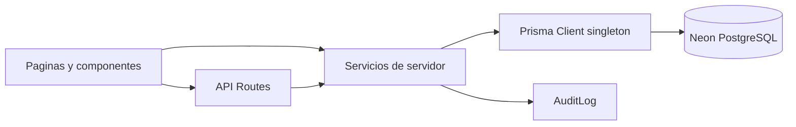
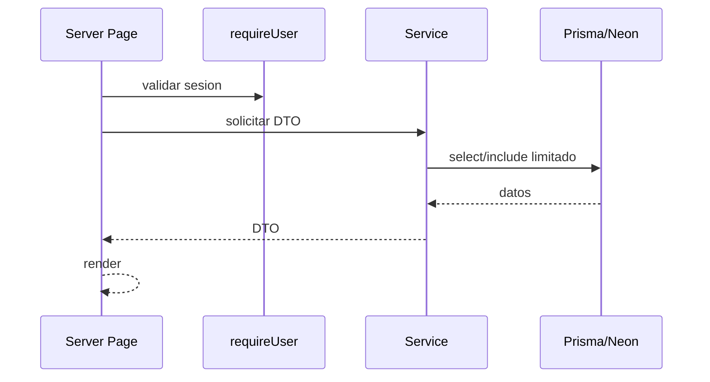
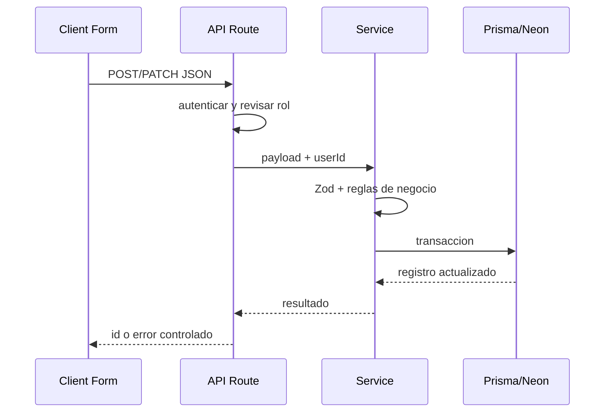

# Arquitectura

Ultima actualizacion: 2026-08-04

## Vista general

La aplicacion usa Next.js App Router. Las paginas en `src/app/` son Server Components por defecto. Los formularios, filtros y acordeones interactivos usan Client Components cuando requieren estado, eventos o APIs del navegador.

## Capas

- UI: `src/app/` y `src/components/`.
- API Routes: `src/app/api/**/route.ts`.
- Servicios: `src/lib/services/`.
- Validaciones: `src/lib/validations/`.
- Autenticacion: `src/lib/auth/`.
- Base de datos: `src/lib/db.ts` y `prisma/schema.prisma`.

## Prisma

`src/lib/db.ts` crea un singleton de `PrismaClient`. En desarrollo lo guarda en `globalThis` para evitar instancias multiples durante hot reload. En produccion exporta una sola instancia sin almacenar globalmente. No se debe llamar `prisma.$disconnect()` por solicitud.

## Autenticacion y permisos

- `src/lib/auth/session.ts` usa cookie HTTP-only `ceacet_session`.
- `getCurrentUser()` devuelve usuario activo.
- `requireUser()` redirige a `/login` cuando no hay sesion.
- `UserRole.READ_ONLY` no puede ejecutar escrituras en APIs de administracion.
- No existe aun un sistema granular de permisos por modulo.

## Validacion

Los formularios usan Zod en `src/lib/validations/`. La validacion final ocurre en servicios del servidor, incluyendo compatibilidad entre nivel, modalidad, grupo, ciclo y periodo.

## Auditoria

`AuditLog` guarda `entity`, `entityId`, `action`, `previousData`, `newData`, `metadata`, `userId` y `createdAt`. Los catalogos usan auditoria transaccional. El endpoint diferido es `/api/catalog-audit/[entity]/[id]`.

## Revalidacion

Las escrituras de catalogos llaman funciones de revalidacion, principalmente en `src/lib/catalog-revalidation.ts` y wrappers como `groups-revalidation.ts`, `modalities-revalidation.ts` y `academic-levels-revalidation.ts`.

## Cache por solicitud

Algunos servicios usan `cache()` de React para catologos activos, por ejemplo `getActiveAcademicLevels()`, `getActiveModalities()`, `getActiveGroups()`, `getActiveSchoolCycles()` y recursos academicos activos.

## Flujo de lectura

## Flujo de escritura

## Manejo de errores

Las APIs de catalogos usan `apiErrorResponse()` para mapear Zod, no encontrado y conflictos. Las APIs de alumnos tienen manejo propio para 400, 401, 403, 404, 409 y 500. No se deben exponer stack traces ni mensajes internos de Prisma.

## Convenciones de dependencia

- UI no debe contener reglas financieras o academicas criticas.
- Servicios no deben depender de componentes.
- Validaciones Zod limpian forma basica; servicios validan relaciones reales.
- Migraciones SQL deben reflejar el schema y revisarse antes de aplicar.
