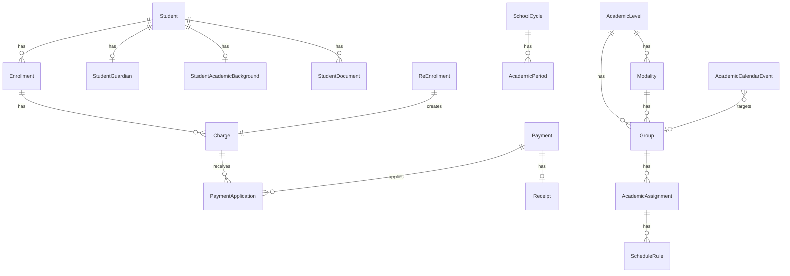

# Modelo de datos

Ultima actualizacion: 2026-08-04

## Diagrama general

## Modelos

### User

Proposito: usuarios administrativos. Campos relevantes: `name`, `email`, `passwordHash`, `role`, `active`. Relaciona pagos, seguimientos, auditoria y metadata de catalogos. No debe exponerse `passwordHash`.

### Student

Proposito: datos del alumno. Tiene matricula unica, nombres, CURP unica opcional, contacto, domicilio y `administrativeStatus`. Relaciona inscripciones, tutor, antecedente, documentos, pagos, seguimientos y reinscripciones.

### StudentGuardian

Proposito: tutor opcional. Relacion uno a uno por `studentId`. `onDelete: Restrict` protege el registro si alguna vez se intenta borrar el alumno.

### StudentAcademicBackground

Proposito: antecedente academico independiente de la inscripcion actual. Puede apuntar a `AcademicLevel` anterior con `onDelete: SetNull`. Relacion uno a uno por alumno.

### StudentDocument

Proposito: documentos del alumno. Relaciona `Student`, `DocumentType` y opcionalmente `AcademicLevel`; `grade` es opcional. La migracion nueva agrega unicidad por alumno, tipo, nivel y grado. Permite boletas por grado sin columnas dedicadas.

### DocumentType

Proposito: catalogo de tipos de documento. Campos: `name`, `required`, `active`.

### Enrollment

Proposito: inscripcion academica. Relaciona alumno, nivel, modalidad, grupo opcional, ciclo y periodo opcionales. Guarda grado, cuatrimestre, fechas y cuotas. `student` usa `onDelete: Cascade` desde el esquema inicial.

### ReEnrollment

Proposito: reinscripcion administrativa y financiera. Relaciona alumno, ciclo, periodo, trayectoria academica, cargo y posible inscripcion resultante. `student` usa `onDelete: Restrict`.

### AcademicLevel

Proposito: nivel academico. Tiene `code`, `description`, `displayOrder`, `active` y metadata de usuario. Relaciona modalidades, grupos, inscripciones, reinscripciones, materias, asignaciones, eventos, antecedentes y documentos.

### Modality

Proposito: programa o modalidad por nivel. Tiene `active`, metadata y relaciones a grupos, inscripciones, reinscripciones, materias, asignaciones y eventos.

### Group

Proposito: grupo academico. Pertenece a nivel y modalidad. Se identifica por `id`, no por `name`. Tiene horario descriptivo, capacidad, estado y metadata.

### SchoolCycle

Proposito: ciclo escolar. Campos: `name`, `code`, fechas, `isActive`, `isCurrent`, metadata. La migracion de ciclos incluye indice unico parcial para un solo ciclo actual.

### AcademicPeriod

Proposito: periodo dentro de un ciclo. Campos: `schoolCycleId`, `displayOrder`, fechas, `isActive`, metadata. La relacion con ciclo usa `onDelete: Restrict`.

### Subject

Proposito: materia. Pertenece a nivel y opcionalmente a modalidad. Tiene `code`, `name`, `description`, `active` y metadata.

### Teacher

Proposito: docente. Tiene `name`, `code`, `email`, `phone`, `specialty`, `description`, `active` y metadata.

### Classroom

Proposito: aula. Tiene `name`, `code`, `location`, `capacity`, `description`, `active` y metadata.

### AcademicAssignment

Proposito: asignacion de materia a grupo, docente, aula y periodo. Guarda tambien nivel y modalidad derivados del grupo para compatibilidad con relaciones existentes.

### ScheduleRule

Proposito: regla recurrente de clases. Usa dia de semana, hora inicial/final, fecha inicial/final y estado activo. No genera filas de evento por cada clase.

### AcademicCalendarEvent

Proposito: evento especial del calendario. Puede apuntar a ciclo, periodo, nivel, modalidad, grupo, materia, docente y aula.

### ChargeConcept

Proposito: catalogo de conceptos de cargo. Tiene codigo unico, monto por defecto y estado activo.

### Charge

Proposito: cargo financiero. Relaciona inscripcion, concepto, vencimiento, montos, balance y estado.

### Payment

Proposito: pago del alumno. Guarda monto, metodo, referencia, fecha, estado y usuario creador.

### PaymentApplication

Proposito: aplicacion de un pago a un cargo. Tiene unique por `paymentId` y `chargeId`.

### Receipt

Proposito: recibo ligado a un pago. Tiene folio unico y `pdfUrl` opcional.

### FollowUp

Proposito: seguimiento academico, financiero, documental o administrativo.

### AuditLog

Proposito: bitacora. Campos: `userId`, `action`, `entity`, `entityId`, `previousData`, `newData`, `metadata`, `createdAt`.

## Riesgos historicos

- Cambiar nombres de catalogos con dependencias puede alterar etiquetas historicas.
- Borrar alumnos afectaria relaciones con cascadas heredadas como `Enrollment`, `Payment` y `StudentDocument`; no hay eliminacion fisica en la UI.
- Indices parciales personalizados deben conservarse en SQL de migracion.
